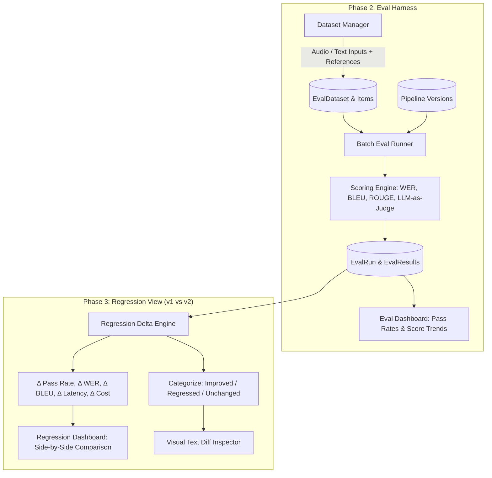

# Evaluation Harness & Regression View: Next-Phase Implementation Roadmap

This document outlines the architecture, database schema, algorithms, API specifications, and UI design for the remaining two phases of the observability & evaluation suite for **Pravah**:
1. **Option 2: Eval Harness** (Fixed test sets, multi-metric scoring engine: WER, BLEU, ROUGE, LLM-as-a-Judge, and pass-rate tracking).
2. **Option 3: Regression View** (v1 vs v2 side-by-side pipeline comparison, delta metrics, regression/improvement categorization, and visual diffs).

---

## Table of Contents
1. [Architecture Overview](#architecture-overview)
2. [Option 2: Evaluation Harness](#option-2-evaluation-harness)
   - [Database Schema](#database-schema-eval-harness)
   - [Scoring Algorithms](#scoring-algorithms)
   - [Batch Eval Runner](#batch-eval-runner)
   - [API Endpoints](#api-endpoints-eval-harness)
   - [UI Components](#ui-components-eval-harness)
3. [Option 3: Regression View (v1 vs v2)](#option-3-regression-view-v1-vs-v2)
   - [Pipeline Versioning Schema](#pipeline-versioning-schema)
   - [Comparison & Delta Engine](#comparison--delta-engine)
   - [API Endpoints](#api-endpoints-regression-view)
   - [UI Components](#ui-components-regression-view)
4. [Step-by-Step Execution Plan & Checklist](#step-by-step-execution-plan--checklist)

---

## Architecture Overview



---

## Option 2: Evaluation Harness

### Database Schema (Eval Harness)

Add to `prisma/schema.prisma`:

```prisma
model EvalDataset {
  id          String            @id @default(cuid())
  userId      String
  projectId   String?
  name        String
  description String?
  domain      String            // "stt" | "translate" | "llm" | "multimodal" | "general"
  createdAt   DateTime          @default(now())
  updatedAt   DateTime          @updatedAt
  items       EvalDatasetItem[]
  evalRuns    EvalRun[]

  @@index([userId])
}

model EvalDatasetItem {
  id             String        @id @default(cuid())
  datasetId      String
  name           String?
  input          Json          // { text: "...", audioUrl: "...", file: "..." }
  expectedOutput Json?         // { text: "...", transcript: "...", translated_text: "..." }
  criteria       Json?         // { minBleu?: 0.8, maxWer?: 0.15, maxLatencyMs?: 1500 }
  createdAt      DateTime      @default(now())
  dataset        EvalDataset   @relation(fields: [datasetId], references: [id], onDelete: Cascade)
  results        EvalResult[]

  @@index([datasetId])
}

model EvalRun {
  id                String       @id @default(cuid())
  pipelineId        String
  pipelineVersionId String?
  datasetId         String
  userId            String
  status            String       @default("pending") // "pending" | "running" | "completed" | "failed"
  summary           Json?        // { passRate: 94.2, avgWer: 0.08, avgBleu: 0.84, avgLatencyMs: 420, totalCost: 1.25 }
  startedAt         DateTime     @default(now())
  finishedAt        DateTime?
  dataset           EvalDataset  @relation(fields: [datasetId], references: [id], onDelete: Cascade)
  pipeline          Pipeline     @relation(fields: [pipelineId], references: [id], onDelete: Cascade)
  results           EvalResult[]

  @@index([pipelineId])
  @@index([datasetId])
}

model EvalResult {
  id              String          @id @default(cuid())
  evalRunId       String
  datasetItemId   String
  status          String          // "passed" | "failed" | "error"
  actualOutput    Json?
  durationMs      Int?
  cost            Float?
  scores          Json            // { wer?: 0.04, bleu?: 0.91, rougeL?: 0.88, judgeScore?: 4.8 }
  judgeReasoning  String?
  error           String?
  evalRun         EvalRun         @relation(fields: [evalRunId], references: [id], onDelete: Cascade)
  datasetItem     EvalDatasetItem @relation(fields: [datasetItemId], references: [id], onDelete: Cascade)

  @@index([evalRunId])
  @@index([datasetItemId])
}
```

---

### Scoring Algorithms (`src/lib/evals/scoring.ts`)

1. **Word Error Rate (WER) & Character Error Rate (CER)**:
   - Evaluates STT speech recognition against reference transcripts.
   - Dynamic programming Levenshtein alignment calculating:
     $$\text{WER} = \frac{S + D + I}{N}$$
     Where $S$ = substitutions, $D$ = deletions, $I$ = insertions, $N$ = total reference words.
   - Handles Indic language tokenization, script normalization, and punctuation stripping.

2. **BLEU Score (Bilingual Evaluation Understudy)**:
   - Evaluates machine translation output quality against ground-truth references.
   - Computes modified n-gram precision ($p_1, p_2, p_3, p_4$) with geometric mean and Brevity Penalty (BP).

3. **ROUGE-L Score**:
   - Longest Common Subsequence (LCS) scoring for text summarization and extraction tasks.

4. **LLM-as-a-Judge (`src/lib/evals/llmJudge.ts`)**:
   - Evaluates complex translation, tone, and reasoning outputs using Gemini / Sarvam models.
   - Standard rubrics:
     - **Faithfulness & Groundedness** (1–5)
     - **Fluency & Grammar** (1–5)
     - **Meaning Preservation** (1–5)
   - Structured JSON response: `{ score: number, passed: boolean, reasoning: string, rubricScores: Record<string, number> }`.

---

### Batch Eval Runner (`src/lib/evals/runner.ts`)

- Iterates through all items in a test set with controlled concurrency (e.g., 2–4 parallel executions).
- Feeds each test case input into the pipeline execution graph.
- Calculates per-item scores and overall suite metrics:
  - **Pass Rate %**
  - **Mean WER**
  - **Mean BLEU**
  - **Mean Latency (ms)**
  - **Total Eval Cost (₹ / credits)**

---

### API Endpoints (Eval Harness)

| Method | Endpoint | Description |
| :--- | :--- | :--- |
| `GET` | `/api/datasets` | List all user & project evaluation datasets |
| `POST` | `/api/datasets` | Create a new test set (manual entry or JSON import) |
| `GET` | `/api/datasets/[datasetId]` | Get dataset details and test cases |
| `POST` | `/api/pipelines/[id]/evals` | Trigger a new evaluation run against a dataset |
| `GET` | `/api/pipelines/[id]/evals` | List all past evaluation runs for a pipeline |
| `GET` | `/api/evals/[evalRunId]` | Fetch detailed test run results, scores, and item breakdown |

---

### UI Components (Eval Harness)

1. **`src/components/evals/DatasetManager.tsx`**:
   - Create/edit datasets.
   - Add test cases with input payload and expected ground truth.
   - Import test cases from JSON / CSV.
2. **`src/components/evals/EvalDashboard.tsx`**:
   - Summary cards: Pass Rate %, Avg WER, Avg BLEU, Avg Latency, Total Cost.
   - Test run history table with pass/fail badges.
   - Test case drill-down modal showing actual vs expected output and judge reasoning.
3. **`src/app/pipeline/[id]/evals/page.tsx`**:
   - Dedicated page accessible directly from the pipeline editor.

---

## Option 3: Regression View (v1 vs v2)

### Pipeline Versioning Schema

Add to `prisma/schema.prisma`:

```prisma
model PipelineVersion {
  id          String    @id @default(cuid())
  pipelineId  String
  version     Int       // 1, 2, 3...
  name        String?   // e.g., "Saaras:v2 Baseline", "Saaras:v3 + Prompt Refinement"
  description String?
  nodes       Json      // Snapshot of SerializedNode[]
  edges       Json      // Snapshot of SerializedEdge[]
  createdAt   DateTime  @default(now())
  pipeline    Pipeline  @relation(fields: [pipelineId], references: [id], onDelete: Cascade)

  @@unique([pipelineId, version])
  @@index([pipelineId])
}

model RegressionComparison {
  id             String   @id @default(cuid())
  userId         String
  baselineRunId  String
  candidateRunId String
  datasetId      String
  summary        Json     // { deltaPassRate: +5.2, deltaWer: -0.04, improvedCount: 8, regressedCount: 1, unchangedCount: 41 }
  createdAt      DateTime @default(now())

  @@index([userId])
}
```

---

### Comparison & Delta Engine (`src/lib/evals/regression.ts`)

- Compares two `EvalRun` records executed on the same `EvalDataset`:
  - **Delta Metrics**:
    $$\Delta \text{PassRate} = \text{PassRate}_{v2} - \text{PassRate}_{v1}$$
    $$\Delta \text{WER} = \text{WER}_{v2} - \text{WER}_{v1} \quad (\text{negative is better } \downarrow)$$
    $$\Delta \text{BLEU} = \text{BLEU}_{v2} - \text{BLEU}_{v1} \quad (\text{positive is better } \uparrow)$$
    $$\Delta \text{Latency} = \text{Latency}_{v2} - \text{Latency}_{v1}$$
    $$\Delta \text{Cost} = \text{Cost}_{v2} - \text{Cost}_{v1}$$
  - **Item Classification**:
    - **Improved (🟢)**: $v1$ failed $\to$ $v2$ passed, or score increased by $> 5\%$.
    - **Regressed (🔴)**: $v1$ passed $\to$ $v2$ failed, or score dropped by $> 5\%$.
    - **Unchanged (⚪)**: No significant change.
  - **Word-Level Visual Diff Generator**:
    - Generates inline diff tokens showing exact substitutions, additions (green), and deletions (red).

---

### API Endpoints (Regression View)

| Method | Endpoint | Description |
| :--- | :--- | :--- |
| `GET` | `/api/pipelines/[id]/versions` | List all saved versions of a pipeline |
| `POST` | `/api/pipelines/[id]/versions` | Snapshot current editor graph as a new version |
| `POST` | `/api/evals/compare` | Compare two eval runs (baseline vs candidate) and compute deltas |

---

### UI Components (Regression View)

1. **`src/components/regression/RegressionView.tsx`**:
   - Version selector dropdowns: **Baseline ($v1$)** vs **Candidate ($v2$)**.
   - **Delta KPI Banner**:
     - $\Delta$ Pass Rate (e.g. `+12.5%` 🟢)
     - $\Delta$ WER (e.g. `-4.2%` 🟢)
     - $\Delta$ Latency (e.g. `-180ms` 🟢)
     - $\Delta$ Cost (e.g. `+0.05 credits` 🔴)
   - Filter chips: `All (50)`, `Improved (8)`, `Regressed (2)`, `Unchanged (40)`.
2. **`src/components/regression/DiffViewer.tsx`**:
   - Side-by-side comparison columns:
     - **Left Column ($v1$)**: Output payload, latency, score, and error logs.
     - **Right Column ($v2$)**: Output payload, latency, score, and error logs.
     - **Visual Diff Inspector**: Highlighting text changes in transcripts or translations.
3. **`src/app/pipeline/[id]/regression/page.tsx`**:
   - Full regression comparison page.

---

## Step-by-Step Execution Plan & Checklist

### Phase 2: Eval Harness
- [ ] Add `EvalDataset`, `EvalDatasetItem`, `EvalRun`, `EvalResult` to `prisma/schema.prisma` & run `npx prisma db push`.
- [ ] Implement `src/lib/evals/scoring.ts` (WER, CER, BLEU, ROUGE-L, Levenshtein distance).
- [ ] Implement `src/lib/evals/llmJudge.ts` (Gemini / Sarvam LLM-as-a-Judge evaluation).
- [ ] Implement `src/lib/evals/runner.ts` (Batch pipeline evaluation runner).
- [ ] Create API routes: `/api/datasets`, `/api/datasets/[id]`, `/api/pipelines/[id]/evals`, `/api/evals/[id]`.
- [ ] Build UI components: `DatasetManager.tsx`, `EvalDashboard.tsx`, `RunEvalModal.tsx`.
- [ ] Create page: `src/app/pipeline/[id]/evals/page.tsx`.
- [ ] Add unit tests (`src/lib/evals/scoring.test.ts`).

### Phase 3: Regression View
- [ ] Add `PipelineVersion` and `RegressionComparison` to `prisma/schema.prisma`.
- [ ] Implement `src/lib/evals/regression.ts` (Delta metrics, item classification, word-level diff generator).
- [ ] Create API routes: `/api/pipelines/[id]/versions`, `/api/evals/compare`.
- [ ] Build UI components: `RegressionView.tsx`, `DiffViewer.tsx`.
- [ ] Create page: `src/app/pipeline/[id]/regression/page.tsx`.
- [ ] Add quick-launch buttons in Toolbar & Navbar for "Evals" and "Regression".
- [ ] Add unit tests (`src/lib/evals/regression.test.ts`).
