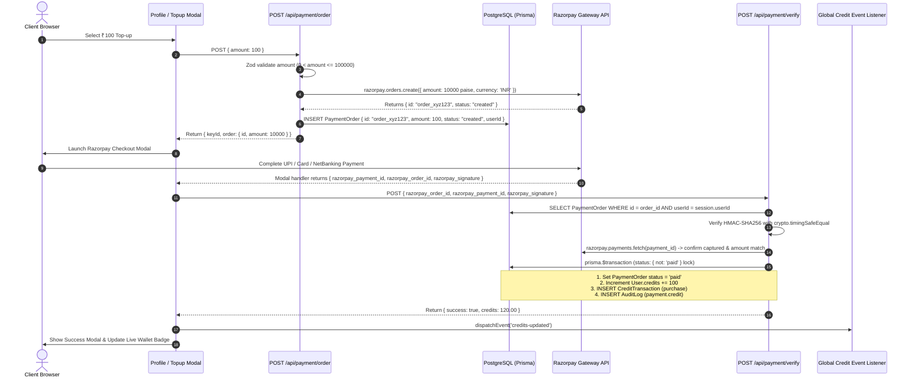
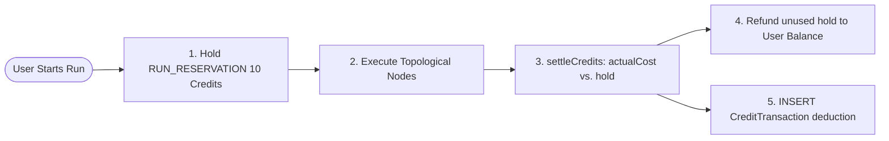

# 💳 Razorpay Payment Integration & Wallet Credit System — Deep Dive

> **Platform:** Pravah AI  
> **Subsystem:** Payment Gateway, Ledger Accounting, Anti-Fraud & Real-Time Wallet Settlement  
> **Key Technologies:** Razorpay Node.js SDK, Web Checkout Modal, PostgreSQL (Prisma ORM), Timing-Safe Cryptography (`crypto.timingSafeEqual`), Atomic DB Transactions, Event-Driven Client State.

---

## 📑 Table of Contents
1. [End-to-End Payment Flow Architecture](#1-end-to-end-payment-flow-architecture)
2. [Step 1: Frontend Checkout Initiation](#2-step-1-frontend-checkout-initiation)
3. [Step 2: Backend Order Creation (`/api/payment/order`)](#3-step-2-backend-order-creation-apipaymentorder)
4. [Step 3: Razorpay Modal Execution & Callback](#4-step-3-razorpay-modal-execution--callback)
5. [Step 4: Backend Payment Verification & Settlement (`/api/payment/verify`)](#5-step-4-backend-payment-verification--settlement-apipaymentverify)
6. [Step 5: Wallet Accounting & Execution Metering (`credits.ts`)](#6-step-5-wallet-accounting--execution-metering-creditsts)
7. [Security & Anti-Fraud Engineering Matrix](#7-security--anti-fraud-engineering-matrix)
8. [20+ Tough Interview Questions & Model Answers](#8-20-tough-interview-questions--model-answers)

---

## 1. End-to-End Payment Flow Architecture



---

## 2. Step 1: Frontend Checkout Initiation

### Location: `src/app/profile/page.tsx`

#### 1. Dynamic SDK Loading:
The Razorpay checkout script is loaded dynamically on demand rather than blocking initial page render:
```typescript
const loadRazorpayScript = (): Promise<boolean> => {
  return new Promise((resolve) => {
    if (document.getElementById('razorpay-sdk')) return resolve(true);
    const script = document.createElement('script');
    script.id = 'razorpay-sdk';
    script.src = 'https://checkout.razorpay.com/v1/checkout.js';
    script.onload = () => resolve(true);
    script.onerror = () => resolve(false);
    document.body.appendChild(script);
  });
};
```

#### 2. Checkout Handler (`handleTopup`):
1. Sets loading state (`isTopupLoading = amount`).
2. Calls `/api/payment/order` to get the validated server order.
3. Initializes `window.Razorpay(options)`.
4. Opens the Razorpay modal.

---

## 3. Step 2: Backend Order Creation (`/api/payment/order`)

### Location: `src/app/api/payment/order/route.ts`

```typescript
const MAX_TOPUP = Number(process.env.MAX_TOPUP_AMOUNT || 100_000);

const bodySchema = z.object({
  amount: z
    .number()
    .positive('Enter a top-up amount greater than zero')
    .max(MAX_TOPUP, `Top-up amount cannot exceed ₹${MAX_TOPUP}`),
});

export const POST = route({ cost: 3, body: bodySchema }, async ({ userId, body }) => {
  const { amount } = body;
  const keyId = process.env.RAZORPAY_KEY_ID;
  const keySecret = process.env.RAZORPAY_KEY_SECRET;

  // Development Mock Guard
  if (!keyId || !keySecret || keyId === 'mock_key_id') {
    if (process.env.NODE_ENV === 'production') {
      throw new ApiError(500, 'Razorpay integration is not configured');
    }
    const mockOrder = {
      id: `order_mock_${Math.random().toString(36).substring(7)}`,
      amount: Math.round(amount * 100),
      currency: 'INR',
      status: 'created',
    };
    await prisma.paymentOrder.create({
      data: { id: mockOrder.id, userId, amount, currency: 'INR', status: 'created' },
    });
    return { success: true, isMock: true, order: mockOrder, keyId: 'mock_key_id' };
  }

  // Live Razorpay API Call
  const razorpay = new Razorpay({ key_id: keyId, key_secret: keySecret });
  const order = await razorpay.orders.create({
    amount: Math.round(amount * 100), // Converted to paise
    currency: 'INR',
    receipt: `receipt_topup_${userId.substring(0, 8)}_${Date.now()}`,
    notes: { userId, amount: String(amount) },
  });

  // Save server-side source of truth
  await prisma.paymentOrder.create({
    data: { id: order.id, userId, amount, currency: 'INR', status: 'created' },
  });

  return { success: true, isMock: false, order, keyId };
});
```

#### Key Architecture Notes:
* **Paise Conversion:** Razorpay requires amounts in the smallest currency unit (paise for INR, 1 INR = 100 paise).
* **Server-Side Price Authority:** The stored database amount is what the verification step will later credit—preventing price tampering.

---

## 4. Step 3: Razorpay Modal Execution & Callback

When the user completes payment, Razorpay invokes the client-side `handler` callback:

```typescript
const options = {
  key: orderData.keyId,
  amount: orderData.order.amount,
  currency: 'INR',
  name: 'Pravah AI',
  description: `Wallet Topup - ₹${amount}`,
  order_id: orderData.order.id,
  handler: async (response: {
    razorpay_payment_id: string;
    razorpay_order_id: string;
    razorpay_signature: string;
  }) => {
    // Dispatches verification to backend
    const verifyRes = await fetch('/api/payment/verify', {
      method: 'POST',
      headers: { 'Content-Type': 'application/json' },
      body: JSON.stringify({
        razorpay_payment_id: response.razorpay_payment_id,
        razorpay_order_id: response.razorpay_order_id,
        razorpay_signature: response.razorpay_signature,
      }),
    });
    
    if (verifyRes.ok) {
      const resJson = await verifyRes.json();
      setProfile((prev) => prev ? { ...prev, credits: resJson.credits } : null);
      window.dispatchEvent(new CustomEvent('credits-updated')); // Updates Navbar
    }
  },
  prefill: {
    name: profile?.name || '',
    email: profile?.email || '',
  },
  theme: { color: '#111827' },
};
```

---

## 5. Step 4: Backend Payment Verification & Settlement (`/api/payment/verify`)

### Location: `src/app/api/payment/verify/route.ts`

```typescript
export const POST = route({ cost: 3, body: bodySchema }, async ({ userId, body }) => {
  const { razorpay_order_id, razorpay_payment_id, razorpay_signature } = body;
  const keyId = process.env.RAZORPAY_KEY_ID;
  const keySecret = process.env.RAZORPAY_KEY_SECRET;

  // 1. Fetch Order from DB (Server-Side Source of Truth)
  const order = await prisma.paymentOrder.findUnique({ where: { id: razorpay_order_id } });
  if (!order || order.userId !== userId) throw notFound('Order not found');

  // 2. Idempotency Check
  if (order.status === 'paid') {
    const user = await prisma.user.findUnique({ where: { id: userId }, select: { credits: true } });
    return { success: true, alreadyProcessed: true, credits: user?.credits ?? 0 };
  }

  const amount = order.amount; // Authoritative amount from DB

  // 3. Timing-Safe HMAC-SHA256 Signature Verification
  const expectedSignature = crypto
    .createHmac('sha256', keySecret)
    .update(`${razorpay_order_id}|${razorpay_payment_id}`)
    .digest('hex');

  const provided = Buffer.from(razorpay_signature);
  const expected = Buffer.from(expectedSignature);
  const signatureValid =
    provided.length === expected.length && crypto.timingSafeEqual(provided, expected);

  if (!signatureValid) {
    await markFailed(razorpay_order_id);
    throw badRequest('Payment signature verification failed');
  }

  // 4. Upstream Direct Verification with Razorpay API
  const razorpay = new Razorpay({ key_id: keyId, key_secret: keySecret });
  let payment;
  try {
    payment = await razorpay.payments.fetch(razorpay_payment_id);
  } catch (err: any) {
    await markFailed(razorpay_order_id);
    throw badRequest('Payment could not be confirmed with payment provider');
  }

  if (
    payment.order_id !== razorpay_order_id ||
    payment.status !== 'captured' ||
    Number(payment.amount) !== Math.round(amount * 100)
  ) {
    await markFailed(razorpay_order_id);
    throw badRequest('Payment could not be confirmed as captured for this order');
  }

  // 5. Atomic Settlement Transaction
  const user = await creditWallet({
    userId,
    orderId: razorpay_order_id,
    amount,
    paymentId: razorpay_payment_id,
    signature: razorpay_signature,
    description: `Wallet top-up via Razorpay (Ref: ${razorpay_payment_id})`,
  });

  return { success: true, isMock: false, credits: user.credits };
});
```

#### The Atomic `creditWallet` Transaction:
```typescript
async function creditWallet({ userId, orderId, amount, paymentId, signature, description }) {
  return prisma.$transaction(async (tx) => {
    // Atomic status guard: Only 1 concurrent request can transition from != 'paid' to 'paid'
    const settled = await tx.paymentOrder.updateMany({
      where: { id: orderId, status: { not: 'paid' } },
      data: {
        status: 'paid',
        razorpayPaymentId: paymentId,
        ...(signature ? { razorpaySignature: signature } : {}),
      },
    });

    // If another concurrent request settled it first, avoid double-crediting
    if (settled.count === 0) {
      return tx.user.findUniqueOrThrow({ where: { id: userId }, select: { credits: true } });
    }

    // 1. Increment User Balance
    const user = await tx.user.update({
      where: { id: userId },
      data: { credits: { increment: amount } },
    });

    // 2. Insert Financial Ledger Record
    await tx.creditTransaction.create({
      data: { userId, amount, type: 'purchase', description },
    });

    // 3. Insert Immutable Audit Log
    await tx.auditLog.create({
      data: {
        userId,
        action: 'payment.credit',
        targetType: 'order',
        targetId: orderId,
        metadata: { amount, paymentId, mock: signature === null },
      },
    });

    return user;
  });
}
```

---

## 6. Step 5: Wallet Accounting & Execution Metering (`credits.ts`)

### Location: `src/lib/api/credits.ts` & `src/lib/api/pricing.ts`



### Key Accounting Functions:
1. **`reserveCredits(userId, amount)`:**
   - Atomic conditional update: `where: { id: userId, credits: { gte: amount } }, data: { credits: { decrement: amount } }`.
   - Runs fail before executing external paid APIs if the user does not have sufficient funds.
2. **`claimReservation(runId, userId)`:**
   - Atomically clears `PipelineRun.reservedCredits = null` where `reservedCredits != null`.
   - Whichever process claims it first (normal settlement or the background stale run reaper) handles the credit refund, preventing double-refunds.
3. **`settleCredits({ userId, reserved, actualCost, runId })`:**
   - Compares `reserved` hold against `actualCost`.
   - Calculates `refund = reserved - actualCost`.
   - Restores the refund to the user's wallet balance in one atomic update.
4. **`reapStaleRuns(userId)`:**
   - Runs left in `running` state beyond `STALE_RUN_MINUTES` (e.g. if a serverless container dies abruptly) are detected, marked `failed`, and refunded automatically.
5. **`DAILY_CREDIT_CEILING` (500 Credits):**
   - Limits rolling 24-hour consumption per tenant to protect shared upstream API quotas from runaway infinite loops.

---

## 7. Security & Anti-Fraud Engineering Matrix

| Threat Vector | Attack Scenario | Pravah AI Defense Mechanism |
| :--- | :--- | :--- |
| **Price Tampering** | Attacker intercepts checkout and sends `amount: 10000` for a ₹10 order. | **Ignored.** Credited amount is read exclusively from the database `PaymentOrder` record created by the server. |
| **Timing Attacks** | Attacker measures string comparison duration to forge HMAC signatures. | **`crypto.timingSafeEqual`** performs constant-time byte comparisons, eliminating side channels. |
| **Double Credit Replay** | Attacker replays valid signature multiple times concurrently. | **Atomic Transaction Guard (`status: { not: 'paid' }`).** Only the first update succeeds; subsequent calls return 0 affected rows and skip crediting. |
| **Fake Payment IDs** | Attacker generates valid signature for a non-existent or failed payment. | **Upstream API Fetch.** Calls `razorpay.payments.fetch(payment_id)` to verify `status === 'captured'` and exact amount match in paise. |
| **IDOR Cross-Tenant Fraud** | User A tries to verify payment using User B's order ID. | **Tenant Scoping.** Query explicitly filters `where: { id: order_id, userId: session.userId }`. |
| **Dev Mock in Production** | Attacker sends `isMock: true` in production environment. | **Production Guard.** Mock orders throw HTTP 500 when `process.env.NODE_ENV === 'production'`. |

---

## 8. 20+ Tough Interview Questions & Model Answers

### Q1: "How do you prevent race conditions and duplicate credit minting when multiple verification webhooks/callbacks hit simultaneously?"
> **Answer:** *"We use an atomic PostgreSQL transaction with a conditional update lock: `tx.paymentOrder.updateMany({ where: { id: orderId, status: { not: 'paid' } }, data: { status: 'paid', razorpayPaymentId } })`. In PostgreSQL, `updateMany` acquires a row-level lock. Only the first transaction that transitions the state from `created` to `paid` receives `count === 1`. Any simultaneous concurrent request receives `count === 0` and is immediately short-circuited without double-incrementing user credits."*

### Q2: "Why is `crypto.timingSafeEqual` necessary for signature verification?"
> **Answer:** *"Standard JavaScript string comparison (`a === b`) short-circuits on the first mismatched character. An attacker can measure sub-microsecond response time variations across thousands of requests to guess the HMAC signature byte-by-byte (timing attack). `crypto.timingSafeEqual` converts strings to `Buffer` and compares all bytes in constant time, preventing side-channel leakage."*

### Q3: "How does the wallet reservation and settlement system work during visual pipeline runs?"
> **Answer:** *"Because pipeline execution is asynchronous and costs scale with character/audio length, we use an upfront reservation pattern. Before any nodes run, `reserveCredits(userId, 10)` atomically decrements 10 credits. If the user cannot afford the hold, the run fails immediately without calling paid APIs. During node execution, cost is metered. In the `finally` block of the stream, `settleCredits()` calculates `refund = 10 - actualCost`, credits the refund back to the user, and logs a `CreditTransaction` deduction."*

### Q4: "What happens if a serverless container crashes mid-stream during an active pipeline run?"
> **Answer:** *"A killed serverless function never reaches its `finally` block. To prevent credit loss and blocked concurrency slots, we implemented an automated stale-run reaper (`reapStaleRuns`). Whenever a user initiates a run or views their runs, runs older than `STALE_RUN_MINUTES` with status `running` are claimed (`reservedCredits != null` guard), marked `failed`, and the exact held credit is refunded."*

### Q5: "Why do you store amounts in paise on the gateway but floats in the database?"
> **Answer:** *"Payment gateways like Razorpay and Stripe strictly require integers in the smallest currency sub-unit (paise for INR, cents for USD) to avoid floating-point rounding errors during financial transactions. On our database and wallet ledger, we store floats (`Float` in Prisma) so we can support micro-metering per character (e.g. ₹0.005 per translated character) while rounding to exact paise for checkout."*

---

*This guide provides complete technical depth for any payment gateway, financial integrity, or ledger accounting question in a Senior Frontend / Full-Stack interview.*
