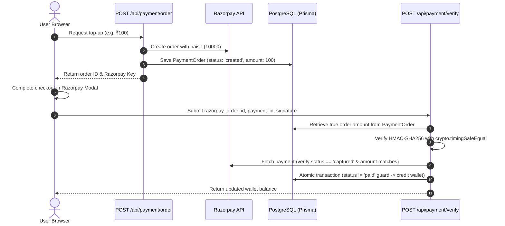

# 🏛️ Pravah AI — Complete System Architecture, Integrations & Interview Master Compendium

> **Project Name:** Pravah AI (Enterprise Visual Multimodal Indic AI Workflow Platform)  
> **Repository:** `test_project_flow` (Pravah)  
> **Target Audience:** Technical Interviewers, Senior Frontend Engineers, Full-Stack Architects, Staff Engineers.

---

## 📑 Complete System Blueprint

```
┌────────────────────────────────────────────────────────────────────────────────────────┐
│                                   PRAVAH AI PLATFORM                                   │
└────────────────────────────────────────────────────────────────────────────────────────┘
                                         │
        ┌────────────────────────────────┴────────────────────────────────┐
        ▼                                                                 ▼
┌─────────────────────────────────────────┐             ┌─────────────────────────────────────────┐
│           FRONTEND ARCHITECTURE         │             │           BACKEND & ORCHESTRATION       │
├─────────────────────────────────────────┤             ├─────────────────────────────────────────┤
│ • Next.js 16 (App Router) + React 19    │             │ • Typed Route Handler Wrapper (route.ts)│
│ • Tailwind CSS v4 + Lucide Icons        │             │ • NextAuth v5 (JWT + Instant Revoke)    │
│ • React Flow (@xyflow/react) Canvas     │             │ • Token-Bucket Rate Limiter             │
│ • Zustand Store + 30-State Ring Buffer  │             │ • Topological DAG Execution Engine      │
│ • Command Palette (⌘K) & Hotkey Manager │             │ • SSE (Server-Sent Events) Streamer     │
│ • In-Browser 16-Bit PCM WAV Audio Engine│             │ • Prisma ORM + PostgreSQL / Neon Serverless
│ • Wavesurfer.js Reactive Audio Scrubber │             │ • Cloudflare R2 S3 Object Storage       │
└─────────────────────────────────────────┘             └─────────────────────────────────────────┘
                                         │
        ┌────────────────────────────────┴────────────────────────────────┐
        ▼                                                                 ▼
┌─────────────────────────────────────────┐             ┌─────────────────────────────────────────┐
│        SARVAM AI INDIC FOUNDATION       │             │       FINANCIAL & WALLET SYSTEM         │
├─────────────────────────────────────────┤             ├─────────────────────────────────────────┤
│ • Saaras:v3 (Speech-to-Text & Chunking) │             │ • Razorpay Order & Payment Lifecycle    │
│ • Bulbul:v3 (Text-to-Speech Synthesis)  │             │ • Timing-Safe HMAC Verification         │
│ • Mayura (22+ Indic Languages Translate)│             │ • Upfront Credit Hold (RUN_RESERVATION) │
│ • Sarvam-105B (Conversational LLM)      │             │ • Pre-Execution Character Cost Metering │
│ • Document AI & Multipage OCR           │             │ • Stale Run Auto-Reaper Engine          │
│ • Transliteration & Language Detection  │             │ • Double-Credit Race Condition Lock     │
└─────────────────────────────────────────┘             └─────────────────────────────────────────┘
```

---

# SECTION 1: FRONTEND ARCHITECTURE & CANVAS ENGINE

### 1.1 Next.js 16 App Router & React 19 Core
* **Hybrid Server / Client Boundary:**
  * Landing page (`src/app/page.tsx`), Documentation (`src/app/docs/page.tsx`), and Node reference directories leverage **React Server Components (RSC)** for fast initial page load and SEO.
  * Flow Canvas (`/pipeline/[id]`), Dashboard (`/dashboard`), and Profiler (`/profile`) are `'use client'` interactive application shells.
* **Route Protection via Edge Middleware (`src/middleware.ts`):**
  * Intercepts `/dashboard/*`, `/pipeline/*`, `/profile/*`, and `/onboarding/*`.
  * Verifies secure cookie tokens (`authjs.session-token`, `__Secure-authjs.session-token`, etc.). Unauthenticated requests are immediately redirected to `/login?callbackUrl=...`.

---

### 1.2 Graph State Machine (Zustand + React Flow)
* **Decoupled Store Architecture (`src/store/pipelineStore.ts`):**
  * Canvas nodes and edges are kept in an external Zustand store rather than component state.
  * Sub-components use atomic selectors (`usePipelineStore(s => s.nodes)`), preventing whole-canvas re-renders when a single node's position or config changes.
* **The Smart Change Filter (`isPersistedChange`):**
  * React Flow emits measurement changes (`dimensions`) on mount and selection changes (`select`) on click.
  * `isPersistedChange` ignores these internal bookkeeping changes, setting `isDirty = true` **only** when positions, node configurations, or graph topology are edited.

---

### 1.3 Time-Travel & Undo/Redo Engine (`⌘Z` / `⌘⇧Z`)
* **30-State Ring Buffer:**
  * Store maintains `past: HistorySnapshot[]` and `future: HistorySnapshot[]` (capped at 30 snapshots).
  * Before any structural mutation (`addNode`, `removeNode`, `removeEdge`, `duplicateNode`, `pasteNode`), a structured clone snapshot of `{ nodes, edges }` is pushed onto `past`.
  * `undo()` pops the previous graph from `past`, pushes the current state to `future`, and restores the canvas.
  * `redo()` pops from `future`, pushes current to `past`, and restores the graph.
* **Canvas Power Shortcuts:**
  * `⌘K` / `Ctrl+K`: Opens the Command Palette.
  * `⌘Z` / `⌘⇧Z` / `Ctrl+Y`: Undo and Redo graph states.
  * `⌘D` / `Ctrl+D`: Instant node duplication (+40px offset with cloned config).
  * `⌘C` / `⌘V`: Clipboard copy/paste of nodes.
  * **Input Safety:** Automatically disabled when focused on `<input>`, `<textarea>`, or content-editable elements.

---

### 1.4 Command Palette (`src/components/flow/CommandPalette.tsx`)
* **Live Fuzzy Search:** Indexes all 25+ node types across 7 categories (Inputs, Processing, Logic, RAG, Regional, Connectors, Outputs).
* **Keyboard Navigation:** Full support for `↑` / `↓` navigation, `Enter` to insert the selected node at viewport center, and `Esc` to dismiss.
* **Viewport Center Math:** Uses `screenToFlowPosition({ x: window.innerWidth / 2, y: window.innerHeight / 2 })` to place the node precisely in the user's view.

---

### 1.5 Client-Side Web Audio & Binary WAV PCM Encoder
* **The Problem:** Browser microphone recordings (`MediaRecorder`) produce compressed WebM chunks. When sending audio to external speech APIs that require sentence chunking, WebM cannot be sliced on byte boundaries.
* **The In-Browser WAV Solution:**
  * Uses `AudioContext` to capture raw `Float32Array` samples.
  * Directly writes a standard **44-byte RIFF/WAVE header** using a `DataView` at 16kHz Mono.
  * Converts float samples (`-1.0` to `+1.0`) into 16-bit signed PCM integers (`s < 0 ? s * 0x8000 : s * 0x7fff`).
  * Emits an in-memory `Blob` with MIME `audio/wav`, enabling instant chunking for recordings of any length.
* **Waveform Scrubbing (`Wavesurfer.js`):**
  * Integrated inside audio nodes and run dialogs.
  * Employs object URL revocation (`URL.revokeObjectURL(url)`) in cleanup hooks to prevent native heap memory leaks.

---

# SECTION 2: BACKEND ARCHITECTURE & REAL-TIME EXECUTION

### 2.1 The Defensive API Route Wrapper (`src/lib/api/route.ts`)
* **Secure-By-Default Paradigm:**
  * Authentication (`auth: true`) is enforced on every endpoint unless explicitly opted out (`auth: false`).
  * Enforces token bucket rate limiting based on authenticated `user:<id>` or anonymous `ip:<clientIp>`.
  * Integrates Zod schema validation for JSON bodies and query parameters.
  * Sanitizes internal exceptions into generic `500 Internal Server Error` responses to prevent stack trace leakage.

---

### 2.2 Topological DAG Execution Engine (`src/lib/execution.ts`)
* **Kahn’s Topological Sorting:**
  * Analyzes the directed acyclic graph (DAG) formed by nodes and edges.
  * Computes in-degree for all nodes and resolves the exact execution sequence.
* **Dynamic Variable Interpolation (`replaceVariables`):**
  * Supports dynamic syntax: `{{nodeId.property}}` or `{{nodeId}}`.
  * Traverses upstream outputs to substitute values (e.g. `{{node_stt.transcript}}` or `{{node_translate.translated_text}}`) before dispatching downstream nodes.
* **Conditional Branching & Router Nodes:**
  * Router nodes evaluate conditions (`equals`, `contains`, `starts_with`, `sentiment`, `numeric comparisons` like `gt`/`lt`).
  * Unchosen branch edges are marked as `deadEdges`. Dependent downstream paths are safely marked as `skipped` without breaking the run.

---

### 2.3 Real-Time Server-Sent Events (SSE) Streaming
* **Endpoint:** `POST /api/pipelines/[id]/run`
* **Transport:** Returns a streaming `Response` with `ReadableStream` and `Content-Type: text/event-stream`.
* **Event Protocol:**
  * `run_started`: Emits initial run ID and node count.
  * `node_started`: Signals which node is currently processing.
  * `node_completed`: Emits output payload, duration, and usage metrics.
  * `node_skipped`: Notifies that a node was bypassed by a router condition.
  * `node_failed`: Emits classified error feedback.
  * `run_completed`: Finalizes execution and delivers the combined output map.
* **Client Cancellation:** Triggers `AbortController.abort()`. The server-side `finally` block detects stream closure and invokes `settleCredits()` to immediately refund held credit balances.

---

# SECTION 3: SARVAM AI FOUNDATION MODEL INTEGRATIONS

Pravah AI integrates deeply with **Sarvam AI**'s suite of Indic foundation models (`src/lib/sarvam.ts`):

```
┌─────────────────────────┬─────────────────────────┬────────────────────────────────────────────────────────┐
│ Capability              │ Endpoint & Model        │ Key Implementation Details                             │
├─────────────────────────┼─────────────────────────┼────────────────────────────────────────────────────────┤
│ **Speech-to-Text (STT)**│ `/speech-to-text`       │ • Saaras:v3 model.                                     │
│                         │ `saaras:v3`             │ • Auto-chunking: Slices audio >30s into WAV segments.  │
│                         │                         │ • Supports 11+ Indic languages and code-mixed audio.   │
├─────────────────────────┼─────────────────────────┼────────────────────────────────────────────────────────┤
│ **Text-to-Speech (TTS)**│ `/text-to-speech`       │ • Bulbul:v3 model with multiple neural speakers.       │
│                         │ `bulbul:v3`             │ • Parallel Sentence Slicing: Splits text into chunks.  │
│                         │                         │ • Binary WAV header concatenation in memory.           │
├─────────────────────────┼─────────────────────────┼────────────────────────────────────────────────────────┤
│ **Indic Translation**   │ `/translate`            │ • Mayura model.                                        │
│                         │ `mayura:v1`             │ • 22 Indian languages with auto-source detection.      │
│                         │                         │ • Formal vs. Classic-Colloquial modes.                 │
├─────────────────────────┼─────────────────────────┼────────────────────────────────────────────────────────┤
│ **Conversational LLM**  │ `/chat/completions`     │ • Sarvam-105B Conversational Model.                    │
│                         │ `sarvam-105b`           │ • Structured JSON system prompts & Markdown stripping. │
├─────────────────────────┼─────────────────────────┼────────────────────────────────────────────────────────┤
│ **Document AI & OCR**   │ `/document-ai`          │ • Scanned PDF & image text extraction.                 │
│                         │ `sarvam-document-ai`    │ • Per-page accounting & OCR verification.              │
├─────────────────────────┼─────────────────────────┼────────────────────────────────────────────────────────┤
│ **Transliteration**     │ `/transliterate`        │ • Phonetic script-to-script conversion (e.g. Latin to   │
│                         │ `sarvam-transliterate`  │   Devanagari, Telugu, Tamil).                          │
├─────────────────────────┼─────────────────────────┼────────────────────────────────────────────────────────┤
│ **Language ID (LID)**   │ `/language-identification` • Detects language and script of multilingual text.  │
└─────────────────────────┴─────────────────────────┴────────────────────────────────────────────────────────┘
```

### Resiliency & Retry Engine
* Custom `fetchWithRetry()` wrapper:
  * Automatically retries transient errors (`408`, `425`, `429`, `500`, `502`, `503`, `504`).
  * Exponential backoff with jitter and `Retry-After` header adherence.
  * Strict **25-second AbortController timeout** per request to prevent hung connections.

---

# SECTION 4: PAYMENT INTEGRITY, WALLET & CLOUDFLARE R2

### 4.1 Razorpay Payment Integrity (`src/app/api/payment/*`)


* **Tampering Immunity:** The credited amount is **always** read from the server's database `PaymentOrder` record, completely ignoring client-supplied amount parameters.
* **Timing-Safe Validation:** HMAC-SHA256 signatures are compared using `crypto.timingSafeEqual()`, mitigating side-channel timing attacks.
* **Race Condition Lock:** Uses an atomic `prisma.$transaction` with `where: { status: { not: 'paid' } }`. Simultaneous duplicate verification calls cannot double-credit the account.

---

### 4.2 Wallet Accounting & Credit Metering (`src/lib/api/credits.ts` & `pricing.ts`)
* **Upfront Reservation (`reserveCredits`):** Every pipeline run reserves `RUN_RESERVATION` credits upfront. Runs fail before calling paid APIs if credits are insufficient.
* **Stale Run Auto-Reaper (`reapStaleRuns`):** Runs lingering in `running` state beyond `STALE_RUN_MINUTES` (caused by container crashes or abrupt timeouts) are automatically reaped and refunded.
* **Daily Blast-Radius Ceiling (`DAILY_CREDIT_CEILING`):** Limits 24-hour spending per tenant to protect upstream shared API quotas.

---

### 4.3 Cloudflare R2 Object Storage Security (`src/lib/r2.ts`)
* **S3-Compatible Binary Proxy:** Connects via AWS S3 SDK with presigned URL capabilities.
* **Path Traversal Defense:** Rejects any filename containing `..` or `/`.
* **Granular Provenance Authorization (`assertObjectAccess`):**
  * Uploaded audio files must strictly match `audio_input_<userId>_*`.
  * Synthesized TTS audio files must match a `NodeRun` record belonging to a project owned by `session.user.id`.

---

# SECTION 5: DATABASE ARCHITECTURE (PRISMA & POSTGRESQL)

```prisma
datasource db {
  provider = "postgresql"
  url      = env("DATABASE_URL")
}

model User {
  id                  String               @id @default(cuid())
  email               String               @unique
  credits             Float                @default(20.00)
  sessionsRevokedAt   DateTime?
  projects            Project[]
  orders              PaymentOrder[]
  transactions        CreditTransaction[]
  auditLogs           AuditLog[]
}

model Project {
  id        String     @id @default(cuid())
  userId    String
  pipelines Pipeline[]
  user      User       @relation(fields: [userId], references: [id], onDelete: Cascade)
}

model Pipeline {
  id        String         @id @default(cuid())
  projectId String
  nodes     PipelineNode[]
  edges     PipelineEdge[]
  runs      PipelineRun[]
  project   Project        @relation(fields: [projectId], references: [id], onDelete: Cascade)
}

model PipelineRun {
  id               String    @id @default(cuid())
  pipelineId       String
  status           String    @default("pending")
  reservedCredits  Float?
  costBreakdown    Json?
  nodeRuns         NodeRun[]
  pipeline         Pipeline  @relation(fields: [pipelineId], references: [id], onDelete: Cascade)
}

model PaymentOrder {
  id                String   @id // Razorpay order ID
  userId            String
  amount            Float
  status            String
  razorpayPaymentId String?  @unique
  user              User     @relation(fields: [userId], references: [id], onDelete: Cascade)
}
```

---

# SECTION 6: 25+ TOUGH INTERVIEW QUESTIONS & MODEL ANSWERS

### Q1: "How did you optimize React Flow for high-frequency dragging and large graphs?"
> **Answer:** *"React Flow can trigger heavy re-render cascades if node state is stored in root components. We decoupled canvas state into an external Zustand store. Nodes subscribe via atomic selectors (`usePipelineStore(s => s.nodes)`), isolating updates. We enabled viewport culling, applied `snapToGrid={[15, 15]}` to debounce layout shifts, and implemented `isPersistedChange` to filter out internal React Flow dimension measurements."*

### Q2: "How did you implement the Undo/Redo time-travel engine?"
> **Answer:** *"We maintain a 30-state snapshot ring-buffer (`past` and `future` arrays) in Zustand. Before any mutating action (`addNode`, `removeNode`, `removeEdge`, `duplicateNode`), we take a structured clone of `{ nodes, edges }` and push it to `past`. Calling `undo()` pops from `past`, saves the current graph to `future`, and replaces the state immutably. Hotkeys (`⌘Z`, `⌘⇧Z`) are guarded to prevent firing when typing in input fields."*

### Q3: "Why choose Server-Sent Events (SSE) over WebSockets for pipeline execution?"
> **Answer:** *"Pipeline execution is a unidirectional stream (progress, logs, outputs) initiated by an HTTP POST request. SSE runs over standard HTTP/2 without dedicated WebSocket server infrastructure, handles browser reconnection natively, and works out-of-the-box in Next.js App Router via `ReadableStream`."*

### Q4: "How does the client-side audio encoder solve the WebM incompatibility problem?"
> **Answer:** *"Browser `MediaRecorder` outputs WebM audio, which cannot be easily sliced into sentence chunks without server-side transcoding. We built an in-browser PCM WAV encoder using `AudioContext` and `DataView` that writes a 44-byte RIFF header and converts Float32 samples into 16-bit signed PCM integers at 16kHz mono. This guarantees full compatibility with Sarvam's Saaras STT engine."*

### Q5: "How does the platform prevent financial race conditions during payment verification?"
> **Answer:** *"We use an atomic database transaction with a status lock: `prisma.paymentOrder.updateMany({ where: { id: orderId, status: { not: 'paid' } }, data: { status: 'paid' } })`. If `count === 0`, a concurrent request has already settled the order. Additionally, the credited amount is read strictly from our database row, not the client request body, and HMAC signatures are compared using `crypto.timingSafeEqual`."*

### Q6: "How do you protect against Insecure Direct Object References (IDOR)?"
> **Answer:** *"Every database lookup enforces multi-tenant ownership queries: `where: { id: params.id, project: { userId } }`. For pipeline cloning, we verify ownership of the source pipeline before extracting its graph. For audio downloads from Cloudflare R2, `assertObjectAccess` verifies that the key contains the caller's user ID or links to a completed node run owned by the user."*

### Q7: "How does the DAG executor handle circular dependencies or branch pruning?"
> **Answer:** *"The executor runs Kahn’s Algorithm for topological sorting. It tracks in-degrees of nodes to identify execution order. If a conditional router node deactivates a branch, all downstream edges on that branch are added to `deadEdges`, and dependent nodes are marked as `skipped` without consuming API credits."*

### Q8: "How would you scale Pravah AI to 100,000 concurrent users?"
> **Answer:**
> 1. **Asynchronous Execution Queue:** Move execution from serverless SSE to a distributed worker queue (Redis + BullMQ) with WebSocket push notifications.
> 2. **Database Pooling:** Use Neon connection pooling with PgBouncer to prevent connection pool exhaustion.
> 3. **Web Workers:** Offload client-side audio PCM encoding and graph layout algorithms (Dagre/ElkJS) to Web Workers.
> 4. **Edge Caching:** Serve static node metadata, public sound samples, and templates from Cloudflare Edge CDN.

---

# SECTION 7: SUMMARY CHEAT SHEET

* **Frontend:** Next.js 16 (App Router), React 19, TypeScript, Tailwind CSS v4, `@xyflow/react`, Zustand, Wavesurfer.js, Lucide Icons.
* **Backend:** Typed `route()` wrapper, NextAuth JWT (with instant revocation), Prisma ORM, PostgreSQL (Neon Serverless), Cloudflare R2.
* **AI Orchestration:** Sarvam AI (Saaras STT, Mayura Translation, Bulbul TTS, Sarvam-105B LLM, Document AI), SSE Streaming, Topological DAG resolution.
* **Security:** Timing-safe payment checks, IDOR multi-tenant isolation, path-traversal prevention, token bucket rate limiting.
