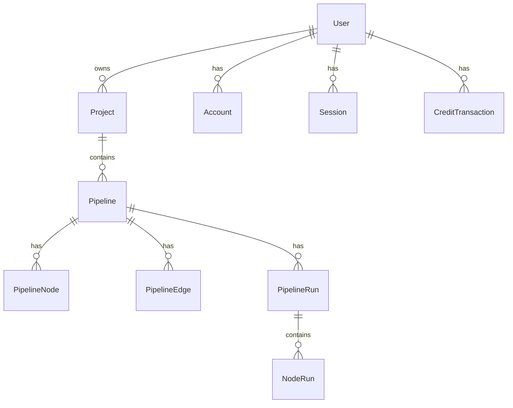

<div align="center">

# 🔀 HasaFlow

**Visual AI Pipeline Builder — Design, Connect & Execute Multilingual AI Workflows**

[](https://nextjs.org/)
[](https://react.dev/)
[](https://www.typescriptlang.org/)
[](https://www.prisma.io/)
[](https://tailwindcss.com/)

[Getting Started](#-getting-started) · [Features](#-features) · [Architecture](#-architecture) · [API Reference](#-api-reference) · [Deployment](#-deployment)

</div>

---

## 📖 Overview

**HasaFlow** is a full-stack visual pipeline builder that lets users design, connect, and execute AI-powered workflows through an intuitive drag-and-drop node editor. Built for multilingual AI processing, it integrates **Sarvam AI** for Indian-language Speech-to-Text, Translation, and Text-to-Speech — all orchestrated through a beautiful, real-time flow graph.

Think of it as **a visual programming environment for AI** — where each node is an AI capability, and edges define the data flow between them.

---

## ✨ Features

### 🧩 Visual Pipeline Editor
- **Drag-and-drop** node-based editor powered by [React Flow](https://reactflow.dev/)
- **20+ node types** — including STT, TTS, Translation, Audio Input/Output, Text Processing, Conditional Logic, HTTP Requests, JSON Transform, Sentiment Analysis, Summarization, and more
- **Real-time edge connections** with animated data-flow paths
- **Per-node configuration panel** with type-specific settings (language selection, model choice, thresholds)

### 🎙️ Multilingual AI Processing
- **Speech-to-Text (STT)** — Transcribe audio in 10+ Indian languages via Sarvam AI
- **Translation** — Translate between Hindi, English, Tamil, Telugu, Bengali, Marathi, Kannada, Gujarati, Malayalam, Punjabi, and more
- **Text-to-Speech (TTS)** — Generate natural-sounding audio from translated text
- **Live Playground** — Test the full STT → Translate → TTS pipeline directly from the landing page

### 🚀 Pipeline Execution Engine
- **Topological execution** — nodes execute in dependency order, automatically resolving the DAG
- **Per-node run logs** — every node records its input, output, timing, and status
- **Run history** — full execution history with expandable logs for debugging
- **Real-time status updates** — watch nodes transition from pending → running → completed

### 💳 Credits & Payments
- **Credit-based usage model** — each pipeline run deducts credits based on node count
- **Razorpay integration** — wallet top-up with real payment processing (sandbox/production)
- **Transaction history** — full audit trail of purchases and deductions

### 🔐 Authentication & Security
- **NextAuth v5 (Auth.js)** — Google OAuth sign-in with secure session management
- **Prisma Adapter** — sessions and accounts stored in PostgreSQL
- **Route protection** — middleware-based auth guards on all private routes
- **Sarvam API limits** — configurable payload-size and text-length limits to prevent abuse

### 📦 Cloud Storage
- **Cloudflare R2** — audio files and pipeline assets stored via S3-compatible API
- **Pre-signed URLs** — secure, time-limited file access

---

## 🏗️ Architecture

```
hasaflow/
├── prisma/
│   └── schema.prisma          # Database schema (User, Project, Pipeline, Nodes, Edges, Runs)
├── public/                    # Static assets
├── src/
│   ├── app/
│   │   ├── page.tsx           # Landing page with live playground
│   │   ├── login/             # Authentication page
│   │   ├── onboarding/        # New user onboarding flow
│   │   ├── dashboard/         # Project management dashboard
│   │   ├── pipeline/          # Visual pipeline editor (React Flow)
│   │   ├── profile/           # User profile, credits & Razorpay wallet
│   │   └── api/
│   │       ├── auth/          # NextAuth endpoints
│   │       ├── projects/      # CRUD for projects
│   │       ├── pipelines/     # CRUD for pipelines, nodes & edges
│   │       ├── runs/          # Pipeline execution & run history
│   │       ├── sarvam/        # Sarvam AI proxy (STT, Translate, TTS)
│   │       ├── audio/         # Audio file handling
│   │       ├── tts/           # Text-to-Speech endpoint
│   │       ├── r2/            # Cloudflare R2 presigned URLs
│   │       ├── payment/       # Razorpay order creation & verification
│   │       ├── user/          # User profile & credits
│   │       └── onboarding/    # Onboarding completion
│   ├── components/
│   │   ├── flow/              # Pipeline editor components
│   │   │   ├── FlowEditor.tsx       # Main React Flow canvas
│   │   │   ├── Toolbar.tsx          # Node palette & pipeline actions
│   │   │   ├── ConfigPanel.tsx      # Per-node configuration sidebar
│   │   │   ├── RunDialog.tsx        # Execution dialog with live logs
│   │   │   ├── ExecutionSidebar.tsx # Run history sidebar
│   │   │   └── nodes/              # Custom node components
│   │   │       ├── BaseNode.tsx     # Shared node shell
│   │   │       ├── GenericNode.tsx  # Universal node renderer
│   │   │       ├── STTNode.tsx      # Speech-to-Text node
│   │   │       ├── TTSNode.tsx      # Text-to-Speech node
│   │   │       └── TranslateNode.tsx
│   │   ├── history/           # Run history components
│   │   ├── layout/            # Shared layout (header, sidebar)
│   │   └── ui/                # Reusable UI primitives
│   ├── lib/
│   │   ├── prisma.ts          # Prisma client singleton
│   │   ├── sarvam.ts          # Sarvam AI SDK wrapper with limit validation
│   │   ├── anthropic.ts       # Anthropic Claude integration
│   │   ├── execution.ts       # Pipeline execution engine (DAG resolver)
│   │   ├── r2.ts              # Cloudflare R2 helpers
│   │   ├── nodeHelp.ts        # Node documentation & help text
│   │   └── seedSampleProject.ts  # Sample pipeline seeder
│   ├── store/
│   │   └── pipelineStore.ts   # Zustand store for pipeline state
│   ├── types/
│   │   ├── pipeline.ts        # Pipeline, Node, Edge type definitions
│   │   └── sarvam.ts          # Sarvam API request/response types
│   ├── middleware.ts          # NextAuth route protection
│   └── auth.ts                # NextAuth configuration
├── .env.example               # Environment variable template
├── package.json
└── tsconfig.json
```

### Tech Stack

| Layer | Technology |
|-------|-----------|
| **Framework** | Next.js 16 (App Router, Server Components) |
| **UI** | React 19, Tailwind CSS 4, Lucide Icons |
| **Flow Editor** | @xyflow/react (React Flow v12) |
| **State** | Zustand 5 |
| **Database** | Neon PostgreSQL (serverless) |
| **ORM** | Prisma 6 with Neon Adapter |
| **Auth** | NextAuth v5 (Auth.js) with Google OAuth |
| **AI Services** | Sarvam AI (STT, Translate, TTS), Anthropic Claude |
| **Storage** | Cloudflare R2 (S3-compatible) |
| **Payments** | Razorpay |
| **Language** | TypeScript 5 |

### Data Model



---

## 🚀 Getting Started

### Prerequisites

- **Node.js** ≥ 18.x
- **npm** ≥ 9.x (or pnpm/yarn)
- A **Neon** PostgreSQL database ([neon.tech](https://neon.tech))
- A **Google Cloud** OAuth client ([console.cloud.google.com](https://console.cloud.google.com))
- A **Sarvam AI** API key ([sarvam.ai](https://www.sarvam.ai))
- *(Optional)* Cloudflare R2, Razorpay, and Anthropic API keys

### Installation

```bash
# 1. Clone the repository
git clone https://github.com/sairaghukiran14/hasaflow.git
cd hasaflow

# 2. Install dependencies
npm install

# 3. Set up environment variables
cp .env.example .env.local
# Edit .env.local with your actual credentials

# 4. Generate Prisma client
npx prisma generate

# 5. Push the schema to your database
npx prisma db push

# 6. Start the development server
npm run dev
```

Open [http://localhost:3000](http://localhost:3000) to see HasaFlow in action.

### First Run

1. **Sign in** with your Google account
2. **Complete onboarding** — a sample pipeline is automatically created for you
3. **Open the dashboard** — your projects and pipelines are listed
4. **Click a pipeline** → the visual editor opens with the drag-and-drop canvas
5. **Add nodes** from the toolbar, connect them with edges, and hit **Run**

---

## 📡 API Reference

All endpoints are under `/api/` and require authentication unless noted.

| Method | Endpoint | Description |
|--------|----------|-------------|
| `GET` | `/api/projects` | List all projects for the authenticated user |
| `POST` | `/api/projects` | Create a new project |
| `GET` | `/api/pipelines?projectId=` | List pipelines in a project |
| `POST` | `/api/pipelines` | Create a new pipeline |
| `PATCH` | `/api/pipelines/[id]` | Update pipeline metadata |
| `DELETE` | `/api/pipelines/[id]` | Delete a pipeline |
| `POST` | `/api/runs` | Execute a pipeline (creates a run) |
| `GET` | `/api/runs?pipelineId=` | List run history for a pipeline |
| `GET` | `/api/runs/[id]` | Get detailed run results with node logs |
| `POST` | `/api/sarvam/stt` | Sarvam Speech-to-Text proxy |
| `POST` | `/api/sarvam/translate` | Sarvam Translation proxy |
| `POST` | `/api/sarvam/tts` | Sarvam Text-to-Speech proxy |
| `POST` | `/api/tts` | Text-to-Speech audio generation |
| `POST` | `/api/audio` | Audio file processing |
| `POST` | `/api/r2/presign` | Generate R2 pre-signed upload/download URLs |
| `POST` | `/api/payment/order` | Create a Razorpay payment order |
| `POST` | `/api/payment/verify` | Verify payment & credit the wallet |
| `GET` | `/api/user` | Get current user profile & credits |
| `POST` | `/api/onboarding` | Mark onboarding as completed |

---

## 🔒 Security

- **No secrets in source** — all credentials are loaded from environment variables; `.env*` files are gitignored
- **Auth middleware** — `src/middleware.ts` protects `/dashboard`, `/pipeline`, `/profile`, and all `/api/*` routes
- **Sarvam payload limits** — configurable `SARVAM_MAX_AUDIO_SIZE_MB` and `SARVAM_MAX_TEXT_LENGTH` prevent oversized requests
- **Prisma parameterised queries** — all database access goes through Prisma, preventing SQL injection
- **Pre-signed URLs** — R2 file access is time-limited and scoped per request

---

## 🌐 Deployment

### Vercel (Recommended)

1. Push this repo to GitHub
2. Import into [Vercel](https://vercel.com/new)
3. Add all environment variables from `.env.example` in the Vercel dashboard
4. Vercel auto-detects Next.js and runs `npm install && npm run build`
5. Your app is live 🎉

### Other Platforms

```bash
# Build for production
npm run build

# Start the production server
npm start
```

> **Important:** Set `NEXTAUTH_URL` / `AUTH_URL` to your production domain.

### Database Migrations

```bash
# Push schema changes to production database
npx prisma db push

# Or use migration-based workflow
npx prisma migrate deploy
```

---

## 📝 Environment Variables

| Variable | Required | Description |
|----------|----------|-------------|
| `AUTH_GOOGLE_ID` | ✅ | Google OAuth Client ID |
| `AUTH_GOOGLE_SECRET` | ✅ | Google OAuth Client Secret |
| `AUTH_SECRET` | ✅ | Random 32+ char string for session encryption |
| `NEXTAUTH_URL` | ✅ | App URL (`http://localhost:3000` in dev) |
| `DATABASE_URL` | ✅ | Neon pooled connection string |
| `DIRECT_URL` | ✅ | Neon direct connection string (for migrations) |
| `SARVAM_API_KEY` | ✅ | Sarvam AI subscription key |
| `R2_ACCOUNT_ID` | ⬡ | Cloudflare R2 account ID |
| `R2_ACCESS_KEY_ID` | ⬡ | Cloudflare R2 access key |
| `R2_SECRET_ACCESS_KEY` | ⬡ | Cloudflare R2 secret key |
| `R2_BUCKET_NAME` | ⬡ | Cloudflare R2 bucket name |
| `ANTHROPIC_API_KEY` | ⬡ | Anthropic Claude API key |
| `RAZORPAY_KEY_ID` | ⬡ | Razorpay key ID (sandbox or live) |
| `RAZORPAY_KEY_SECRET` | ⬡ | Razorpay key secret |

✅ = Required &nbsp;&nbsp; ⬡ = Optional (feature-specific)

---

## 🛠️ Development

```bash
# Run dev server with hot reload
npm run dev

# Lint the codebase
npm run lint

# Open Prisma Studio (database GUI)
npx prisma studio

# Generate Prisma client after schema changes
npx prisma generate
```

---

## 📄 License

This project is proprietary software. All rights reserved.

---

<div align="center">

**Built with ❤️ by [HasaFlow](https://github.com/sairaghukiran14/hasaflow)**

</div>
